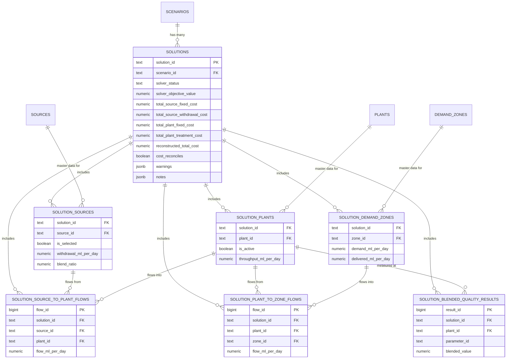

# Entity–Relationship Diagram for Solver Output Data

**Author**: Joshua Kempster

The diagram below displays a proposed schema for storing the solution output in a structured database.

**Design decisions**:

- No duplication of data: source, plant and other data that is input to the model is not included in the solution output. The ids are incldued and can be mapped back to the original tables.
- Sources, Plants and Demand Zone tables have composite primary keys that combine the solution_id and node id (e.g. source_id), so that a solution cannot be accidentally joined to the wrong sources. This is not represented in the diagram, which needs to be fixed, but it was causing rendering issues.
- A scenario can have multiple solutions (depending on the version of the model, or if a different solver is used), hence each solution has a unique id.
- The number of sources, plants, demand zones and quality measures can and will change per scenario, hence tables are long and joined, rather than being wide and requiring updates to schema if fields are added.

> [!warning] Note for data engineering team
> The exact schema is not finalised, but I do have DDL statements for each of the tables proposed below, so if you're happy with it, I can share that too.

