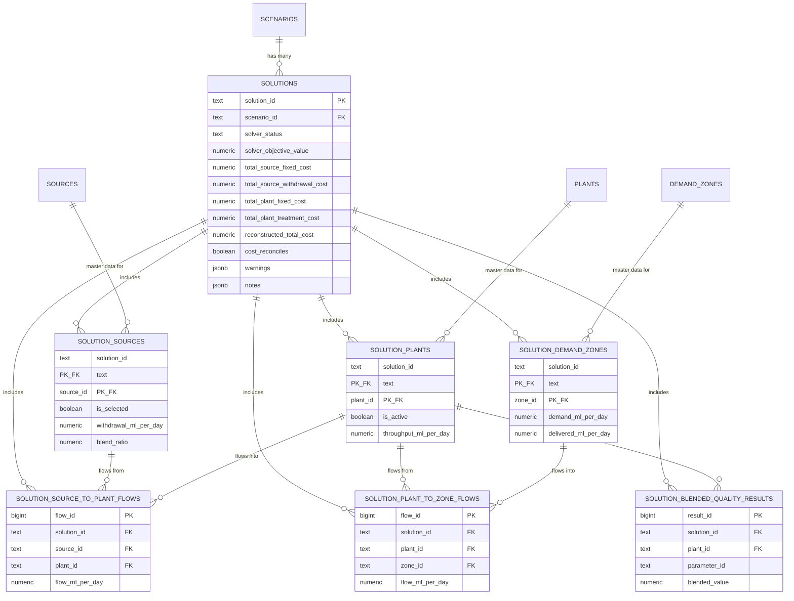

# Proposed Schema for Solution Data

This doc proposed a schema to turn a json solved scenario into structured data in an SQL database. Note that `solution_id`, `plant_id`, `source_id`, and `zone_id` have composite keys so you can't accidentally join a flow from one solve to a plant row from another.

## 1. `solutions` (main table)

One row per solver run. Holds solver status, the objective value, the full cost breakdown, and the warnings/notes emitted by that run.

```sql
CREATE TABLE solutions (
    solution_id                    TEXT PRIMARY KEY,
    scenario_id                    TEXT NOT NULL REFERENCES scenarios(scenario_id),
    description                    TEXT,

    -- solver outcome
    solver_status                  TEXT NOT NULL,             -- 'Optimal', 'Infeasible', ...
    solver_objective_value         NUMERIC(18,4) NOT NULL,

    -- cost breakdown (folded in from the former cost_breakdown table)
    total_source_fixed_cost        NUMERIC(18,4) NOT NULL DEFAULT 0,
    total_source_withdrawal_cost   NUMERIC(18,4) NOT NULL DEFAULT 0,
    total_plant_fixed_cost         NUMERIC(18,4) NOT NULL DEFAULT 0,
    total_plant_treatment_cost     NUMERIC(18,4) NOT NULL DEFAULT 0,
    reconstructed_total_cost       NUMERIC(18,4) NOT NULL,
    cost_reconciles                BOOLEAN NOT NULL,

    -- free-text output (folded in from the former warnings/notes tables)
    warnings                       JSONB NOT NULL DEFAULT '[]'::jsonb,   -- array of strings
    notes                          JSONB NOT NULL DEFAULT '[]'::jsonb,   -- array of strings

    is_draft                       BOOLEAN NOT NULL DEFAULT TRUE,
    created_at                     TIMESTAMPTZ NOT NULL DEFAULT now()
);

CREATE INDEX idx_solutions_scenario_id ON solutions(scenario_id);
```

## 2. `solution_sources`

One row per candidate source considered _in this solution_ (selected and unused alike). References the existing master `sources` table.

```sql
CREATE TABLE solution_sources (
    solution_id                   TEXT NOT NULL REFERENCES solutions(solution_id) ON DELETE CASCADE,
    source_id                     TEXT NOT NULL REFERENCES sources(source_id),
    is_selected                   BOOLEAN NOT NULL,
    withdrawal_ml_per_day         NUMERIC(18,4) NOT NULL DEFAULT 0,
    blend_ratio                   NUMERIC(10,8),
    fixed_cost_contribution       NUMERIC(18,4) NOT NULL DEFAULT 0,
    withdrawal_cost_contribution  NUMERIC(18,4) NOT NULL DEFAULT 0,
    PRIMARY KEY (solution_id, source_id)
);
```

## 3. `solution_plants`

One row per treatment plant considered in this solution. References the master `plants` table.

```sql
CREATE TABLE solution_plants (
    solution_id                    TEXT NOT NULL REFERENCES solutions(solution_id) ON DELETE CASCADE,
    plant_id                       TEXT NOT NULL REFERENCES plants(plant_id),
    is_active                      BOOLEAN NOT NULL,
    throughput_ml_per_day          NUMERIC(18,4) NOT NULL DEFAULT 0,
    fixed_cost_contribution        NUMERIC(18,4) NOT NULL DEFAULT 0,
    treatment_cost_contribution    NUMERIC(18,4) NOT NULL DEFAULT 0,
    PRIMARY KEY (solution_id, plant_id)
);
```

## 4. `solution_demand_zones`

One row per demand zone considered in this solution. References the master `demand_zones` table.

```sql
CREATE TABLE solution_demand_zones (
    solution_id             TEXT NOT NULL REFERENCES solutions(solution_id) ON DELETE CASCADE,
    zone_id                 TEXT NOT NULL REFERENCES demand_zones(zone_id),
    demand_ml_per_day       NUMERIC(18,4) NOT NULL,
    delivered_ml_per_day    NUMERIC(18,4) NOT NULL,
    PRIMARY KEY (solution_id, zone_id)
);
```

## 5. `solution_source_to_plant_flows`

Network edge: source → plant, for this solution.

```sql
CREATE TABLE solution_source_to_plant_flows (
    flow_id           BIGSERIAL PRIMARY KEY,
    solution_id       TEXT NOT NULL REFERENCES solutions(solution_id) ON DELETE CASCADE,
    source_id         TEXT NOT NULL,
    plant_id          TEXT NOT NULL,
    is_active         BOOLEAN NOT NULL,
    flow_ml_per_day   NUMERIC(18,4) NOT NULL,
    FOREIGN KEY (solution_id, source_id) REFERENCES solution_sources(solution_id, source_id),
    FOREIGN KEY (solution_id, plant_id)  REFERENCES solution_plants(solution_id, plant_id),
    UNIQUE (solution_id, source_id, plant_id)
);
```

## 6. `solution_plant_to_zone_flows`

Network edge: plant → demand zone, for this solution.

```sql
CREATE TABLE solution_plant_to_zone_flows (
    flow_id           BIGSERIAL PRIMARY KEY,
    solution_id       TEXT NOT NULL REFERENCES solutions(solution_id) ON DELETE CASCADE,
    plant_id          TEXT NOT NULL,
    zone_id           TEXT NOT NULL,
    is_active         BOOLEAN NOT NULL,
    flow_ml_per_day   NUMERIC(18,4) NOT NULL,
    FOREIGN KEY (solution_id, plant_id) REFERENCES solution_plants(solution_id, plant_id),
    FOREIGN KEY (solution_id, zone_id)  REFERENCES solution_demand_zones(solution_id, zone_id),
    UNIQUE (solution_id, plant_id, zone_id)
);
```

## 7. `solution_blended_quality_results`

One row per water-quality parameter measured at a plant's inflow, for this solution.

```sql
CREATE TABLE solution_blended_quality_results (
    result_id        BIGSERIAL PRIMARY KEY,
    solution_id       TEXT NOT NULL REFERENCES solutions(solution_id) ON DELETE CASCADE,
    plant_id          TEXT NOT NULL,
    applies_to        TEXT NOT NULL DEFAULT 'blend_at_plant_inflow',
    parameter_id      TEXT NOT NULL,          -- 'pH', 'alkalinity', 'turbidity', ...
    unit              TEXT,
    blended_value     NUMERIC(18,8) NOT NULL,
    lower_limit       NUMERIC(18,8),
    upper_limit       NUMERIC(18,8),
    lower_margin      NUMERIC(18,8),
    upper_margin      NUMERIC(18,8),
    is_binding        BOOLEAN NOT NULL DEFAULT FALSE,
    FOREIGN KEY (solution_id, plant_id) REFERENCES solution_plants(solution_id, plant_id),
    UNIQUE (solution_id, plant_id, parameter_id)
);
```

---

# Entity–Relationship Diagram



---

# Example Rows (from the sample scenario)

Assume the scenario `base_scenarios_test_v1` already exists in `scenarios`, and this solve produced `solution_id = 'sol_2026081601'`.

## `solutions`

| solution_id    | scenario_id            | solver_status | solver_objective_value | total_source_fixed_cost | total_source_withdrawal_cost | total_plant_fixed_cost | total_plant_treatment_cost | reconstructed_total_cost | cost_reconciles | warnings | notes                                                                                                                                                                                                                                                                                                                                                                                                                                                                                                                                                                           |
| -------------- | ---------------------- | ------------- | ---------------------- | ----------------------- | ---------------------------- | ---------------------- | -------------------------- | ------------------------ | --------------- | -------- | ------------------------------------------------------------------------------------------------------------------------------------------------------------------------------------------------------------------------------------------------------------------------------------------------------------------------------------------------------------------------------------------------------------------------------------------------------------------------------------------------------------------------------------------------------------------------------- |
| sol_2026081601 | base_scenarios_test_v1 | Optimal       | 533000.0000            | 0.0000                  | 533000.0000                  | 0.0000                 | 0.0000                     | 533000.0000              | true            | `[]`     | `["This file is a deterministic test scenario and is not a source of verified operational data.", "Fields for energy estimate, quality values after treatment, treatment removal quantities, and mineral/chemical addition quantities are intentionally absent because chemical dosing and batching are disabled for this scenario...", "'blended_quality' currently reports quality at plant inflow only, matching quality_limits.applies_to in base_scenarios_v1.json.", "The scenario remains marked as draft until its expected MILP solution is independently verified."]` |

## `solution_sources`

| solution_id    | source_id | is_selected | withdrawal_ml_per_day | blend_ratio | fixed_cost_contribution | withdrawal_cost_contribution |
| -------------- | --------- | ----------- | --------------------- | ----------- | ----------------------- | ---------------------------- |
| sol_2026081601 | 225103    | true        | 700.0000              | 0.58333333  | 0.0000                  | 315000.0000                  |
| sol_2026081601 | 229421    | true        | 300.0000              | 0.25000000  | 0.0000                  | 114000.0000                  |
| sol_2026081601 | 233217    | true        | 200.0000              | 0.16666667  | 0.0000                  | 104000.0000                  |

## `solution_plants`

| solution_id    | plant_id | is_active | throughput_ml_per_day | fixed_cost_contribution | treatment_cost_contribution |
| -------------- | -------- | --------- | --------------------- | ----------------------- | --------------------------- |
| sol_2026081601 | plant_1  | true      | 1200.0000             | 0.0000                  | 0.0000                      |

## `solution_demand_zones`

| solution_id    | zone_id | demand_ml_per_day | delivered_ml_per_day |
| -------------- | ------- | ----------------- | -------------------- |
| sol_2026081601 | zone_1  | 1200.0000         | 1200.0000            |

## `solution_source_to_plant_flows`

| flow_id | solution_id    | source_id | plant_id | is_active | flow_ml_per_day |
| ------- | -------------- | --------- | -------- | --------- | --------------- |
| 1       | sol_2026081601 | 225103    | plant_1  | true      | 700.0000        |
| 2       | sol_2026081601 | 229421    | plant_1  | true      | 300.0000        |
| 3       | sol_2026081601 | 233217    | plant_1  | true      | 200.0000        |

## `solution_plant_to_zone_flows`

| flow_id | solution_id    | plant_id | zone_id | is_active | flow_ml_per_day |
| ------- | -------------- | -------- | ------- | --------- | --------------- |
| 1       | sol_2026081601 | plant_1  | zone_1  | true      | 1200.0000       |

## `solution_blended_quality_results`

| result_id | solution_id    | plant_id | applies_to            | parameter_id | unit       | blended_value | lower_limit | upper_limit | lower_margin | upper_margin | is_binding |
| --------- | -------------- | -------- | --------------------- | ------------ | ---------- | ------------- | ----------- | ----------- | ------------ | ------------ | ---------- |
| 1         | sol_2026081601 | plant_1  | blend_at_plant_inflow | pH           | pH         | 7.09358601    | 6.5         | 8.5         | 0.59358601   | 1.40641399   | false      |
| 2         | sol_2026081601 | plant_1  | blend_at_plant_inflow | alkalinity   | mg/L CaCO3 | 47.91666667   | 20.0        | 200.0       | 27.91666667  | 152.08333333 | false      |
| 3         | sol_2026081601 | plant_1  | blend_at_plant_inflow | turbidity    | NTU        | 1.31666667    | 0.0         | 5.0         | 1.31666667   | 3.68333333   | false      |

---
